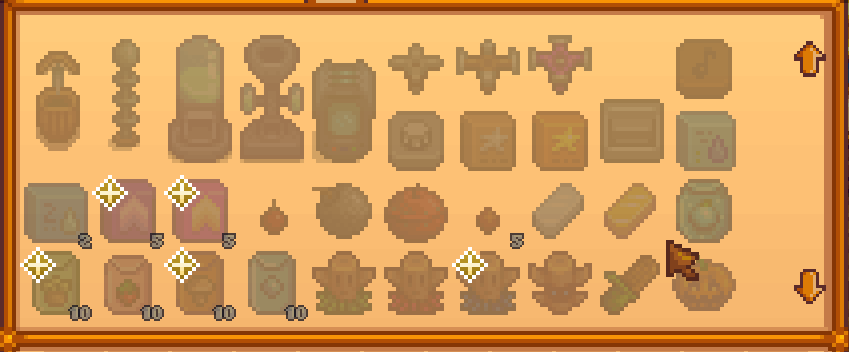

# New Recipes Marker
_A Mod for Stardew Valley_

- **Author:** [Stef Schulz](mailto:s.schulz@slothsoft.de)
- **Repository:** <https://github.com/slothsoft/stardew-new-recipes-marker>
- **Open Issues:** <https://github.com/slothsoft/stardew-new-recipes-marker/issues>

A mod for [Stardew Valley](https://www.stardewvalley.net/) that marks recipes you haven't crafted yet, so you can more easily hunt achievements: 

Created due to the Corona Boredom and because I wanted to try something brand new.

**Content of this ReadMe:**

- [Getting Started](#getting-started)
- [Developer Notes](#developer-notes)
- [License](#license)

## Getting Started

### Prerequisites

You need **[SMAPI](https://smapi.io/)** to run any kind of mods. And of course you need **[Stardew Valley](https://www.stardewvalley.net/)**.

### Installing

1. Install [SMAPI](https://smapi.io/)
1. Unzip this mod to the _mods/_ folder

### Using the Mod

The mod automatically hooks into the game menu. You don't need to do anything more than opening the crafting menu. 

## Developer Notes

_(This section are more or less notes to myself.)_

**Used Tutorials:**

- How to setup IDE: [Modding:IDE reference](https://stardewvalleywiki.com/Modding:IDE_reference
- How to create first mod: [Modding:Modder Guide/Get Started](https://stardewvalleywiki.com/Modding:Modder_Guide/Get_Started)
- How to do some common tasks: [Modding:Common tasks](https://stardewvalleywiki.com/Modding:Common_tasks)
- SMAPI API: [Modding:Modder Guide/APIs](https://stardewvalleywiki.com/Modding:Modder_Guide/APIs)
- Stardew Valley API: [StawdewValley on GitHub](https://github.com/AdamMcIntosh/StawdewValley)

## License

This project is licensed under the MIT License - see the [MIT license](LICENSE) for details.